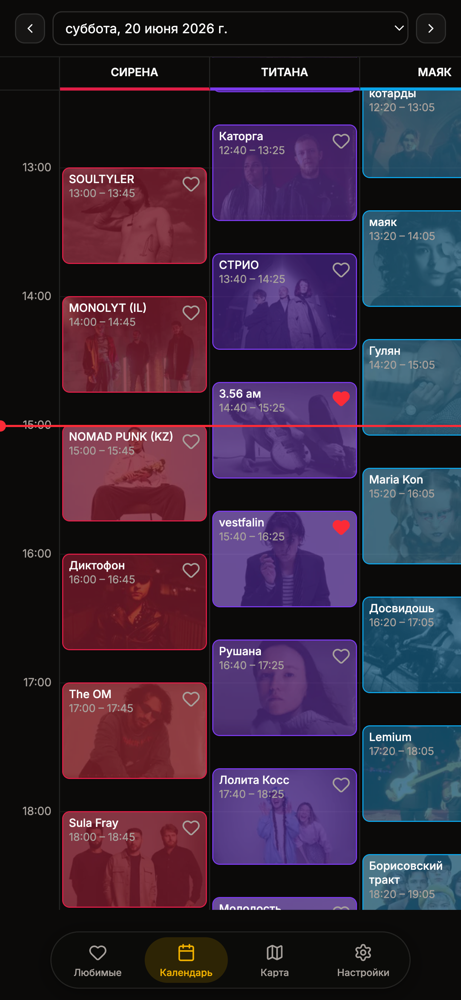
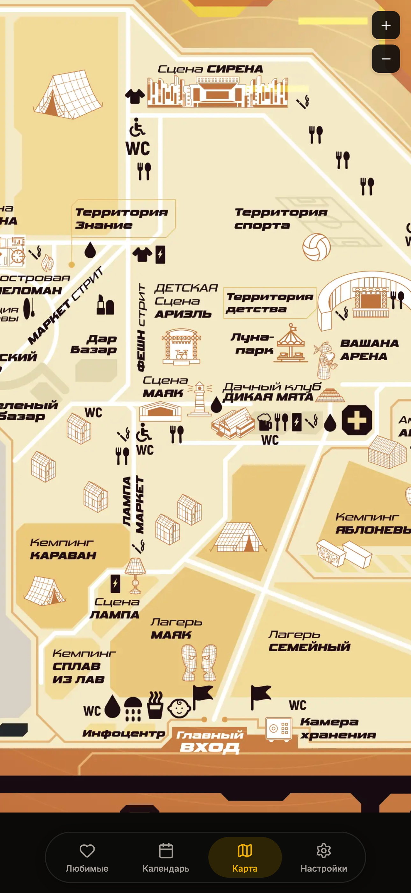
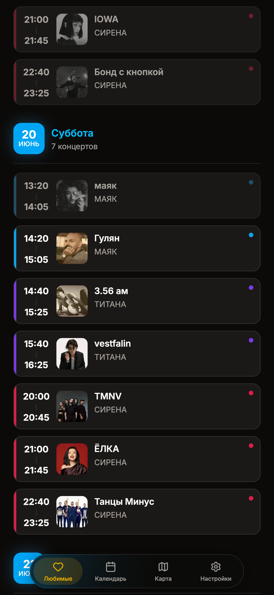

# Дикая Мята — календарь фестиваля

**[Открыть приложение → wildmint.brofrong.ru](https://wildmint.brofrong.ru/)**

Неофициальный календарь фестиваля **Дикая Мята 2026**. Удобно смотреть расписание по сценам, отмечать любимых артистов и ориентироваться на карте площадки — прямо в браузере, без установки и регистрации.

> Сайт не связан с организаторами фестиваля. Это фановый проект: исходный код открыт, данные о вас никуда не отправляются.

## Что умеет

- **Любимые** — сохраняйте концерты сердечком и смотрите их списком по дням
- **Календарь** — расписание выступлений по сценам с переключением дней
- **Карта** — схема площадки фестиваля
- **Офлайн** — можно добавить на главный экран телефона и пользоваться без интернета

## Как выглядит

### Календарь



### Карта



### Избранное



---

## Для разработчиков

Основное приложение — `apps/wildmint-front`.

### Разработка

Требуется [Bun](https://bun.sh/) 1.3+.

```sh
bun install
bun --filter wildmint-front dev
```

Сборка:

```sh
bun --filter wildmint-front build
bun --filter wildmint-front start
```

### Docker

Образ публикуется в [brofrong/wildmint-front](https://hub.docker.com/r/brofrong/wildmint-front) (CI: `.github/workflows/docker-wildmint-front.yml`).

#### Запуск из Docker Hub

```yaml
# docker-compose.yml
services:
  wildmint-front:
    image: brofrong/wildmint-front:latest
    ports:
      - "3000:3000"
    environment:
      PORT: 3000
    restart: unless-stopped
```

```sh
docker compose up -d
```

#### Сборка образа локально

```yaml
# docker-compose.yml
services:
  wildmint-front:
    build:
      context: apps/wildmint-front
      dockerfile: Dockerfile
    ports:
      - "3000:3000"
    environment:
      PORT: 3000
    restart: unless-stopped
```

```sh
docker compose up -d --build
```

Лицензия: [MIT](LICENSE)
